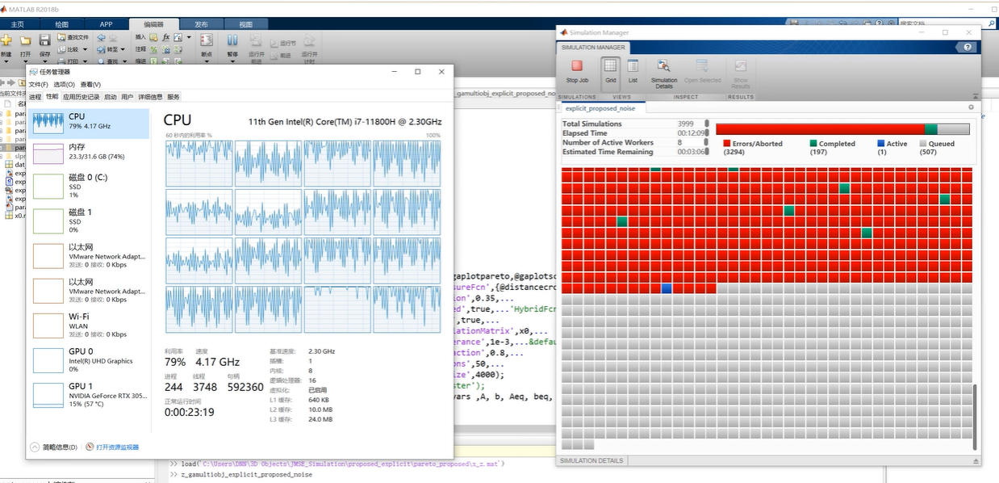

# parallel multi objective optimization using Simulink and MATLAB
This is just a simple example of how to optimize parameters in simulink models;  Parallel computing can greatly increase speed.  

## How to run
* run gamultiobj_GSTA.m
* recommed MATLAB 2018b, the newer version may cause some unexpected problems
